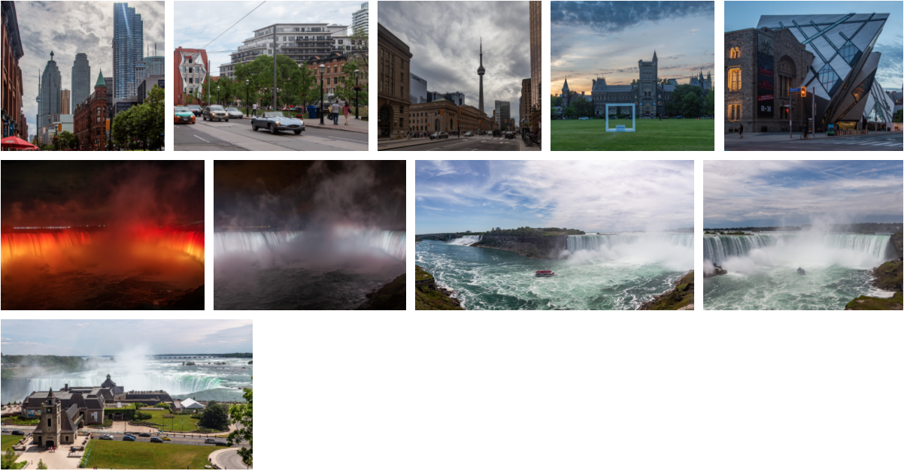

Gatsy Images Grid
=================

Integrates [React Images Grid](../react-images-grid) with beautiful React Images carousel.



Demo: https://kirill-konshin.github.io/images-grid/as-images/.

## Installation

This component requires [Gatsby Plugin MDX](https://www.gatsbyjs.org/packages/gatsby-plugin-mdx/)!

```bash
yarn install gatsby-images-grid
# or
npm install gatsby-images-grid
```

## Usage

First of all, import styles. To do that create or update file `garsby-browser.js`:

```js
import 'react-images-grid/src/styles.css';
```

### As images

The easiest way to use gallery is to wrap a number of images (for example in the blog post) with `ImagesGallery`. Images in this example are places right near the blog entry's markdown:

```mdx
---
title: "As Images"
date: "2020-02-08T00:00:00.000Z"
description: "Gallery of images defined in MDX"
featuredImage: ./Image-04.jpg
---

This mode allows to give each image a meaningful title.

<ImagesGallery>


</ImagesGallery>
```

### As files

This mode requires a bit more configuration but provides more automatic approach.

You will have to modify your [blog post layout](https://www.gatsbyjs.org/packages/gatsby-plugin-mdx/#default-layouts) for like so.

Assume your normal blog post layout looks like this:

```js
import React from 'react';
import {graphql} from 'gatsby';
import {MDXRenderer} from 'gatsby-plugin-mdx';

import {Layout} from '../components/layout';

const BlogPostTemplate = ({
    data: {
        mdx: post
    },
    location,
}) => {
    return (
        <Layout
            location={location}
            title={post.frontmatter.title}
            description={post.frontmatter.description || post.excerpt}
        >
            <h1>{post.frontmatter.title}</h1>
            <p>&nbsp;{post.frontmatter.date}</p>
            <MDXRenderer>{post.body}</MDXRenderer>
        </Layout>
    );
};

export default BlogPostTemplate;

export const pageQuery = graphql`
    query BlogPostBySlug($slug: String!, $absolutePathRegex: String!) {
        mdx(fields: {slug: {eq: $slug}}) {
            id
            excerpt(pruneLength: 160)
            body
            frontmatter {
                title
                date(formatString: "MMMM DD, YYYY")
                description
            }
        }
    }
`;
```

You can use technique from this issue to get all images from the blog post folder: https://github.com/gatsbyjs/gatsby/issues/11246:

```diff
import React from 'react';
import {graphql} from 'gatsby';
import {MDXRenderer} from 'gatsby-plugin-mdx';

import {Layout} from '../components/layout';

const BlogPostTemplate = ({
    data: {
        mdx: post,
+        allFile: {nodes: images = []},
    },
    location,
}) => {
    return (
        <Layout
            location={location}
            title={post.frontmatter.title}
            description={post.frontmatter.description || post.excerpt}
        >
            <h1>{post.frontmatter.title}</h1>
            <p>&nbsp;{post.frontmatter.date}</p>
-            <MDXRenderer>{post.body}</MDXRenderer>
+            <MDXRenderer images={images}>{post.body}</MDXRenderer>
        </Layout>
    );
};

export default BlogPostTemplate;

export const pageQuery = graphql`
    query BlogPostBySlug($slug: String!, $absolutePathRegex: String!) {
        mdx(fields: {slug: {eq: $slug}}) {
            id
            excerpt(pruneLength: 160)
            body
            frontmatter {
                title
                date(formatString: "MMMM DD, YYYY")
                description
            }
        }
+        # here we search for all image-like files in blog directory
+        allFile(filter: {extension: {regex: "/(jpg|jpeg|png)/"}, absolutePath: {regex: $absolutePathRegex}}) {
+            nodes {
+                name
+                childImageSharp {
+                    fixed {
+                        ...GatsbyImageSharpFixed
+                    }
+                    original {
+                        src
+                    }
+                }
+            }
+        }
    }
`;
```

You need to put `$absolutePathRegex` into context in `/gatsby-node.js` (for more info take a look at this [issue](https://github.com/gatsbyjs/gatsby/issues/11246#issuecomment-612793091)):

```js
exports.createPages = async ({graphql, actions}) => {
    const {createPage} = actions;

    const {
        data: {
            allMdx: {edges: posts},
        },
    } = await graphql(`
        query Blog { ... usual stuff }
    `);

    posts.forEach(
        ({
            node: {
                fileAbsolutePath,
                fields: {slug},
            },
        }) => {
            createPage({
                path: slug,
                component: path.resolve(`src/templates/blog-post.js`),
                context: {
                    slug,
                    //@see https://github.com/gatsbyjs/gatsby/issues/11246#issuecomment-612793091
                    absolutePathRegex: `/^${path.dirname(fileAbsolutePath)}/`, 
                },
            });
        },
    );
};
```

Now in blog entries we can use the `FilesGallery`: 

```mdx
---
title: "As files"
date: "2018-06-09T00:00:00.000Z"
description: "Gallery of files defined in template"
featuredImage: ./Image-02.jpg
---

This mode just dumps all image-like files from current directory as gallery.

import {FilesGallery} from 'gatsby-images-grid';
<FilesGallery>{props.images}</FilesGallery>
```

### With layout (optional)

If you don't want to import galleries in each blog post you can use `MDXProvider`.

Follow MDX plugin documentation to create a layout with `MDXProvider` from `@mdx-js/react` (which you've installed for `gatsby-plugin-mdx`): https://www.gatsbyjs.org/packages/gatsby-plugin-mdx/#mdxprovider and https://www.gatsbyjs.org/packages/gatsby-plugin-mdx/#default-layouts.

Add `FilesGallery` and `ImagesGallery` from `gatsby-images-grid`:

```js
// src/components/layout.js

import React from 'react';
import {MDXProvider} from '@mdx-js/react';
import {FilesGallery, ImagesGallery} from 'gatsby-images-grid';

const components = {FilesGallery, ImagesGallery};

export const Layout = ({children, title}) => (
    <MDXProvider components={components}>
        <div style={{maxWidth: '1200px', margin: '0 auto'}}>
            <h1>{title}</h1>
            <div>{children}</div>
        </div>
    </MDXProvider>
);

export default Layout;
```