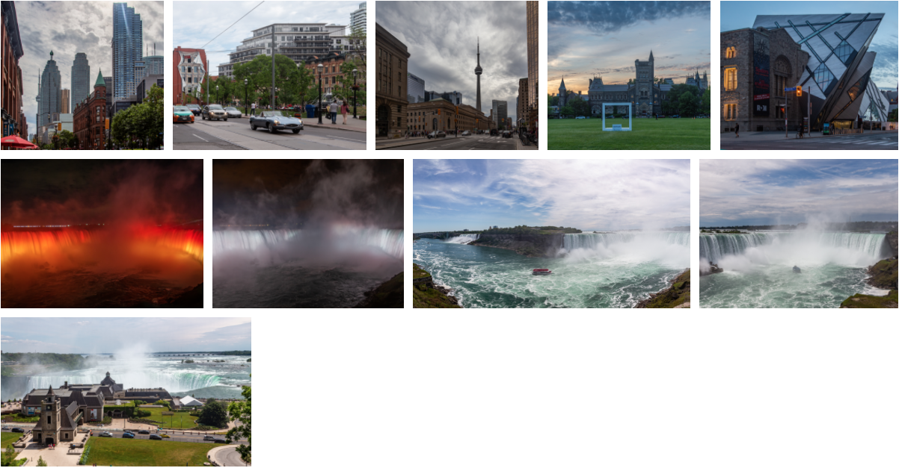

React Images Grid
=================

Component to create a flexible responsive images grid using flex box and React.



## Installation

```bash
yarn install react-images-grid
# or
npm install react-images-grid
```

## Usage

```js
import React from 'react';
import {Gallery} from 'react-images-grid';

import 'react-images-grid/src/styles.css';

export default () => (
    <div style={{maxWidth: '1200px', margin: '0 auto'}}>
        <Gallery
            images={[
                {src: '/Image-01.jpg', thumbnail: '/Image-01.jpg', title: 'Streets of Toronto', width: 500, height: 600},
                {src: '/Image-02.jpg', thumbnail: '/Image-02.jpg', title: 'University', width: 500, height: 600},
                {src: '/Image-03.jpg', thumbnail: '/Image-03.jpg', title: 'Museum', width: 500, height: 600},
                {src: '/Image-04.jpg', thumbnail: '/Image-04.jpg', title: 'Niagara in the night', width: 500, height: 600},
                {src: '/Image-05.jpg', thumbnail: '/Image-05.jpg', title: 'Niagara', width: 500, height: 600},
                {src: '/Image-06.jpg', thumbnail: '/Image-06.jpg', title: 'Niagara, view from the car', width: 500, height: 600},
            ]}
            onSelect={index => console.log('Selected', index)}
        />
    </div>
);
```

If you don't know exact sizes use `GalleryMeasurer`:

```js
import React from 'react';
import {GalleryMeasurer} from 'react-images-grid';

import 'react-images-grid/src/styles.css';

export default () => (
    <div style={{maxWidth: '1200px', margin: '0 auto'}}>
        <GalleryMeasurer
            images={[
                {src: '/Image-01.jpg', thumbnail: '/Image-01.jpg', title: 'Streets of Toronto'},
                {src: '/Image-02.jpg', thumbnail: '/Image-02.jpg', title: 'University'},
                {src: '/Image-03.jpg', thumbnail: '/Image-03.jpg', title: 'Museum'},
                {src: '/Image-04.jpg', thumbnail: '/Image-04.jpg', title: 'Niagara in the night'},
                {src: '/Image-05.jpg', thumbnail: '/Image-05.jpg', title: 'Niagara'},
                {src: '/Image-06.jpg', thumbnail: '/Image-06.jpg', title: 'Niagara, view from the car'},
            ]}
            onSelect={index => console.log('Selected', index)}
        />
    </div>
);
```

## API

Both `Gallery` and `GalleryMeasurer` accept following props:

- `images` — an array of images in following format `{src: string, thumbnail: string, title: string, width?: number, height?: number}`
- `onSelect` — callback called when thumbnail has been clicked 
- `maxOccupiedSpace = 0.3` — maximum horizontal space occupied by single thumbnail (good for panoramas and wide images)
- `minOccupiedSpace = 0.15` — minimum horizontal space occupied by single thumbnail (good for portraits and tall images)

### `GalleryMeasurer`

- `Loading` — a component will be shown while measuring is in progress
- `Error` — a component will be shown if measuring encountered an error: `<Error error={error}/>`
- `Empty` — a component will be shown if no images provided